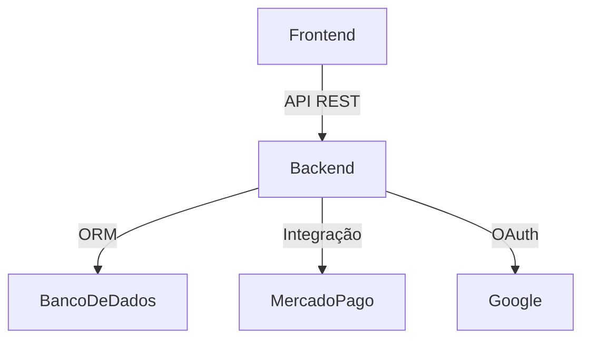

# docs/README.md

## Sobre esta pasta
Esta pasta contém a documentação técnica e de negócio do projeto Paivas Burguers.

- `ARQUITETURA.md`: Arquitetura geral do sistema, fluxos principais, diagramas e boas práticas.

## Exemplo de diagrama

## Rotas já implementadas (resumo)

**Backend:**
- `POST /auth/register` — Cadastro de usuário
- `POST /auth/token` — Login tradicional
- `GET /auth/me` — Dados do usuário autenticado
- `POST /auth/google-login` — Login/cadastro Google OAuth2
- `GET /auth/google-login/web` — Fluxo web Google OAuth2
- `GET /auth/google-login/web/callback` — Callback Google OAuth2

**Frontend:**
- `/register` — Cadastro
- `/login` — Login
- `/privacidade` — Política de Privacidade
- `/cookies` — Política de Cookies

> Mantenha este arquivo atualizado sempre que endpoints ou fluxos mudarem.

**Promoções automáticas:**
- Produtos/tamanhos entram e saem da aba Promoções conforme o preço promocional.
- Mensagem animada personalizada aparece quando não há promoções e some automaticamente quando houver promoções.

**Próximos passos:**
- Área administrativa para promoções via painel
- Notificações para clientes
- Testes automatizados
